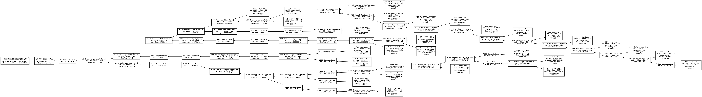
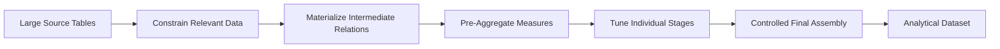

# query_plan_optimization

### Analytical SQL Optimization through Materialization, Cardinality Control & Staged Execution

`QUERY OPTIMIZATION` `DATA ENGINEERING` `ANALYTICAL SQL`

This repository presents an anonymized historical case study in optimizing a large analytical SQL workload by changing the **shape of the query**, rather than attempting to tune one enormous execution plan in place.

The original workload combined a large number of joins, mappings, aggregates, derived measures, and business rules into a single relational expression.

As complexity grew, cardinality uncertainty propagated through the query until the optimizer was attempting to reason about a very large search space with increasingly inaccurate estimates.

The resulting execution plan provides a particularly clear example:

| Metric | Result |
|---|---:|
| **Estimated final rows** | ~484 |
| **Actual final rows** | **3,038,173** |
| **Cardinality error** | ~6,270× |
| **Optimizer result** | Early termination — `TimeOut` |

The solution was to stop treating the workload as one optimization problem.

Instead, the query was decomposed into **smaller, materialized, independently tunable stages**.

---

## The Problem

Large analytical queries are often elegant when expressed as a single chain of CTEs, joins, aggregates, and derived expressions.

Elegance at the SQL level, however, does not guarantee that the optimizer can accurately reason about the resulting relational expression.

Conceptually, the original workload resembled:

```text
source data
    ↓
joins
    ↓
more joins
    ↓
mapping logic
    ↓
aggregations
    ↓
derived measures
    ↓
additional joins
    ↓
additional aggregations
    ↓
final analytical dataset
```

Each transformation introduced additional uncertainty about the number and distribution of rows reaching the next operator.

Eventually:

```text
small estimation error
        ↓
larger join estimation error
        ↓
incorrect intermediate cardinality
        ↓
poor downstream assumptions
        ↓
optimizer search complexity
        ↓
unstable execution strategy
```

The saved historical execution plan shows the result.

### Original Execution Plan



The plan has been reconstructed and anonymized while preserving its operator topology, estimates, actual row counts, and other performance characteristics.

---

## Optimization Strategy

Rather than attempting to force the optimizer into producing a better plan for the entire expression, the workload was divided into smaller relational problems.



The key techniques were:

### 1. Constrain data early

Large source tables were reduced to only the entities participating in the analytical workload before expensive downstream processing.

For example:

```sql
WHERE EXISTS
(
    SELECT 1
    FROM #request_distribution AS rd
    WHERE rd.SOURCE_SYSTEM = r.SOURCE_SYSTEM
      AND rd.CLIENT_ID = r.CLIENT_ID
      AND rd.REQUEST_ID = r.REQUEST_ID
)
```

This limits the domain that later joins and aggregations need to process.

---

### 2. Materialize logical stages

Instead of maintaining one enormous relational expression, important intermediate datasets were written into temporary relations:

```text
#program
#request_distribution
#request
#supplier
#distribution_count
#submission_metrics
#hire_metrics
...
```

Each stage becomes a concrete dataset rather than another logical branch inside the same optimizer problem.

This creates natural **optimization boundaries**.

---

### 3. Pre-aggregate expensive measures

Candidate activity, request distributions, orders, hires, evaluations, and other measures were aggregated independently before being introduced into the final analytical relation.

Instead of repeatedly reasoning across detailed transactional rows:

```text
candidate rows
order rows
distribution rows
evaluation rows
        ↓
one enormous query
```

the architecture becomes:

```text
candidate rows    → candidate metrics
order rows        → hire metrics
distribution rows → distribution metrics
evaluation rows   → evaluation metrics

                         ↓

                 final assembly
```

The final query therefore joins already-controlled datasets at known analytical grains.

---

### 4. Tune intermediate objects independently

Once an intermediate relation exists physically, it can be observed and tuned independently.

Indexes can be introduced where useful:

```sql
CREATE INDEX IX_request_distribution_keys
    ON #request_distribution
       (SOURCE_SYSTEM, CLIENT_ID, REQUEST_ID);

CREATE INDEX IX_submission_metrics_keys
    ON #submission_metrics
       (SOURCE_SYSTEM, CLIENT_ID, REQUEST_ID, SUPPLIER_ID);
```

The objective is **not to index every temporary table**.

The objective is to make each stage independently understandable and tunable.

---

### 5. Assemble the final relation progressively

The surviving optimization work also experimented with joining the materialized objects into successive stages:

```text
#program
    +
#request_distribution
    ↓
#stage_01

#stage_01
    +
#request
    ↓
#stage_02

#stage_02
    +
#business_unit
    ↓
#stage_03

    ...
```

This gives the optimizer a series of smaller problems rather than asking it to simultaneously solve the entire analytical workload.

---

## Why Decomposition Helps

Query decomposition changes the optimizer's problem.

### Monolithic approach

```text
A
 ├── B
 │   ├── C
 │   │   ├── D
 │   │   └── E
 │   └── F
 ├── G
 │   ├── H
 │   └── I
 └── J
     ├── K
     └── L

        ↓

optimizer must reason about the entire expression
```

### Decomposed approach

```text
A + B + C
    ↓
 Stage 1

D + E
    ↓
 Stage 2

F + G + H
    ↓
 Stage 3

Stage 1 + Stage 2 + Stage 3
              ↓
          Final Result
```

The individual engine determines exactly how materialization, statistics, caching, indexing, and optimization boundaries behave.

The architectural principle remains the same:

> **Reduce uncertainty before asking the optimizer to make the next decision.**

---

## Beyond SQL Server

The historical workload in this case study ran on **Microsoft SQL Server**, but the technique is not fundamentally SQL Server-specific.

The same design principle appears in modern analytical engineering:

```text
SQL Server
    → temporary tables / staged relations

dbt
    → intermediate models / materialized models

Snowflake
    → staged transformations / temporary or transient relations

Analytical warehouses
    → bounded transformations at intentional grains
```

The implementation mechanics differ by engine.

The underlying problem does not:

**large declarative expressions can become easier to optimize, understand, test, and maintain when intentionally decomposed into controlled relational stages.**

---

## Repository Contents

| Asset | Purpose |
|---|---|
| [`staged_decomposition.sql`](staged_decomposition.sql) | Anonymized example of early filtering, materialization and pre-aggregation |
| [`indexed_assembly.sql`](indexed_assembly.sql) | Anonymized example of indexed intermediate relations and progressive assembly |
| [`execution_plan_anonymized.svg`](execution_plan_anonymized.svg) | Reconstructed historical execution plan with production identifiers removed |
| [`execution_plan_anonymized.png`](execution_plan_anonymized.png) | Raster version of the reconstructed plan |

---

## Historical Artifact

This repository is based on surviving development artifacts from a historical production optimization effort.

The surviving material includes:

- an actual SQL Server execution plan
- portions of the decomposition rewrite
- experimental indexed assembly code
- intermediate optimization work

The final production query and its final performance benchmark were not retained.

Accordingly, this repository does **not** attempt to reconstruct an undocumented runtime improvement or claim a performance percentage that can no longer be verified.

Instead, it preserves the part that can be demonstrated directly:

**the original optimizer failure, the architecture of the problem, and the query-decomposition strategy used to address it.**

All database names, table names, column names, client identifiers, supplier identifiers, and other production-specific information shown in this repository have been removed or replaced with representative examples.

---

## What This Project Demonstrates

This case study demonstrates practical reasoning about:

- analytical query architecture
- query decomposition
- cardinality estimation
- optimizer behavior
- relational data flow
- materialization boundaries
- pre-aggregation
- intermediate-object tuning
- staged execution
- execution-plan interpretation
- SQL performance engineering

The central lesson is simple:

> **Sometimes the best way to optimize a complicated query is to stop making it one query.**
